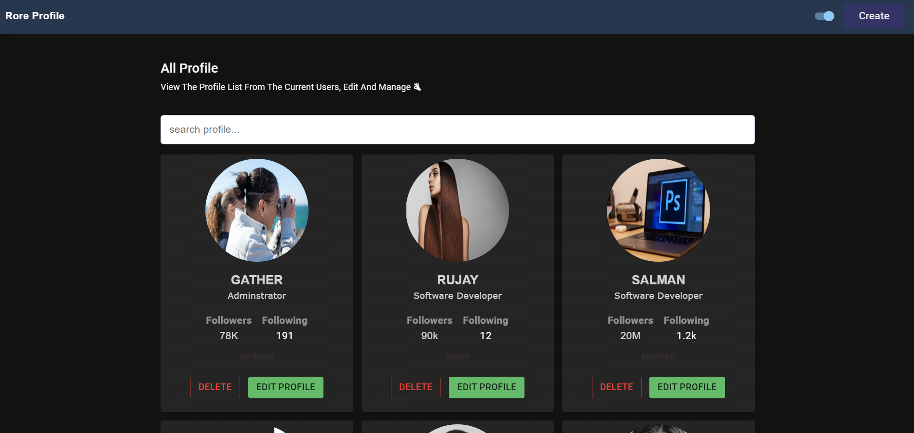
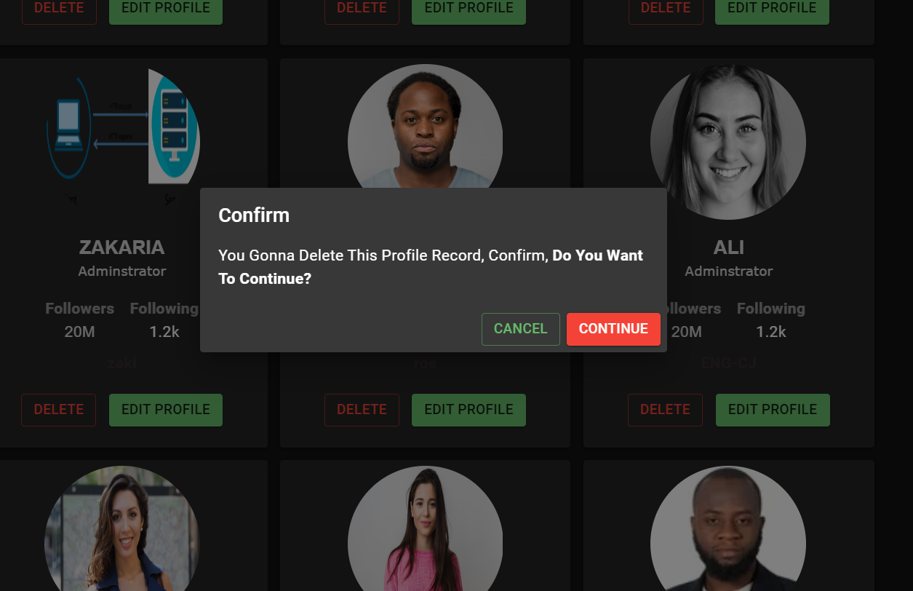
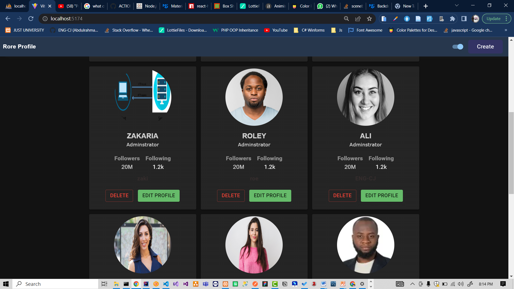

# ACTION-USER-PROFILES-NODE-MYSQL-REACT-LINKER
A simple action-user-profile using mernMYSQL - eventDriven Linker

# SETUP Guidline
After downling or cloning this repo, to setup follow this steps 
1. 1st install missing node-modules, to install go to <kbd>clien</kbd> folder and write thise command <kbd>npm install</kbd>. same as go to <kbd>Server</kbd> 
And run same command <kbd>npm install</kbd>
2. after installing node modules, configure database by import database to your mysql server (php/myadmin). The DB is inside the <kbd>Data</kbd> Folder
3. locate <kbd>Server folder</kbd> and run this command <kbd>npm start or nodemon index.js</kbd> Same way start the client side by locating  
the client folder and run this command <kbd>npm run dev</kbd>

# Rore Profiles Screen

# ANY Help
Email: abdulrahmandev10@gmail.com
